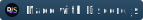

<p align='Center'>


</p>

# MM-Utilities

Simple Bot for [MM Gamer discord server](https://discord.com/invite/ASr2B3ZZSY)

# Features

- Youtube Feed
- Music
- Ticket
- Suggestion
- Info
- Self Roles
- Afk
- Report

# Selfhosting

#### Requirements

- Node.js (v16.9.0 or higher)
- Discord.js (v13.8.0 or higher)
- Mongoose (v6.x or higher)
- Express (4.x or higher)

#### Setting up

- **Need to make changes to code to make it work correctly**
- Clone the repository and go to the directory
- run `npm install` to install all dependencies
- Configure the `config.json` file

```json
{
  "activityType": "Put activity type here",
  "activityName": "Put activity name here",
  "botColor": "Put HEX here",
  "errColor": "Put HEX here",
  "DeveloperIDs": ["Put Developer Id here"]
}
```

- Configure the `.env` file

```env
PORT=Your port number
botToken=Your bot token
guildIds=["Your guild id", ""]
mongooseConnectionString=Your mongoose connection string
LAVALINK_IDENTIFIER=["Node 1", "Node 2"]
LAVALINK_HOST=["in.example.com", "us.example.com"]
LAVALINK_PASSWORD=["Password 1", "Password 2"]
SPOTIFY_CLIENT_ID=Your spotify client id
SPOTIFY_CLIENT_SECRET=Your spotify client secret
YT_hubCallback=Your youtube callback url
YT_SECRET=Your youtube secret
environment=Your environment
```

- Run `npm start` to start the bot directly
- Run `npm run build` to build the project and then run `npm start:prod` to start the bot

# Database

This project uses MongoDb for database

# License

MIT License (c) 2022 DeveloperLand

# Contributing

Contributing to this project is welcomed.
